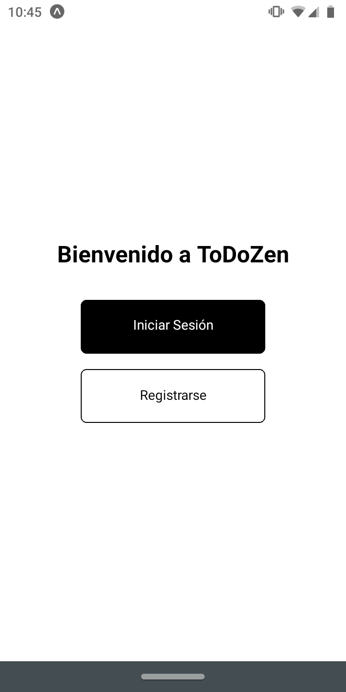
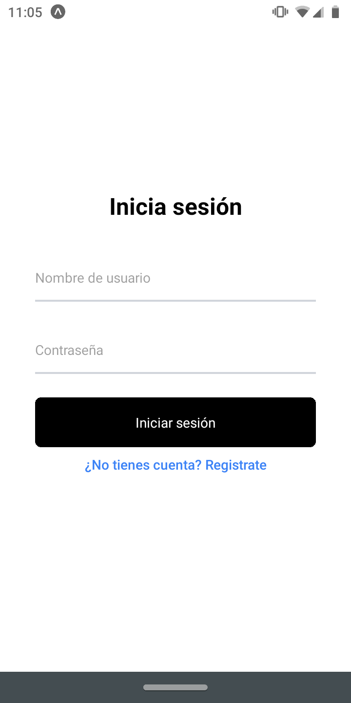
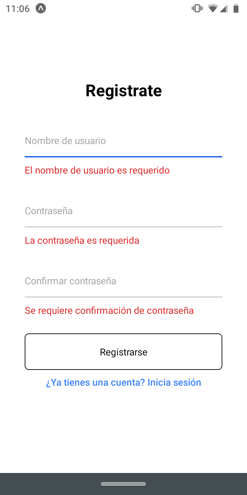
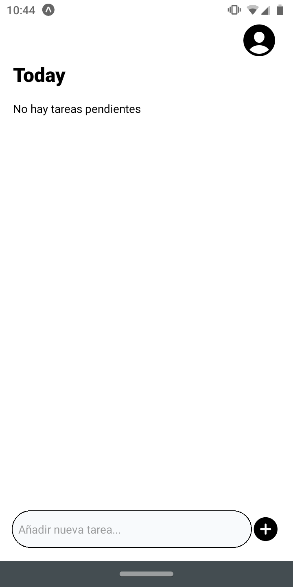
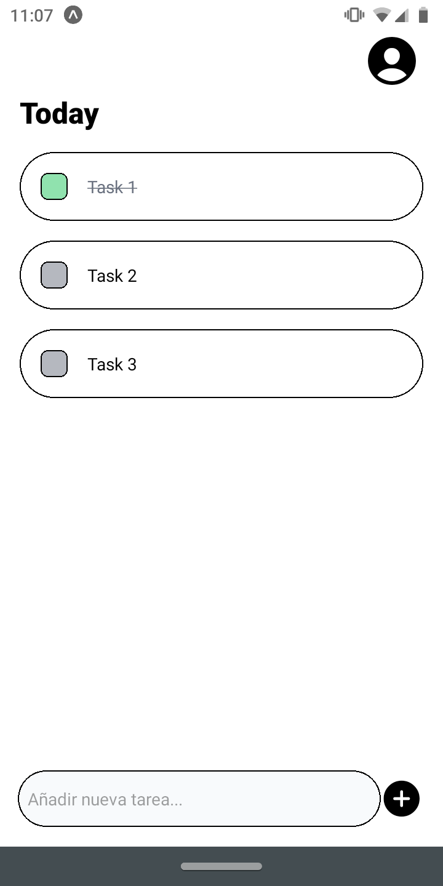
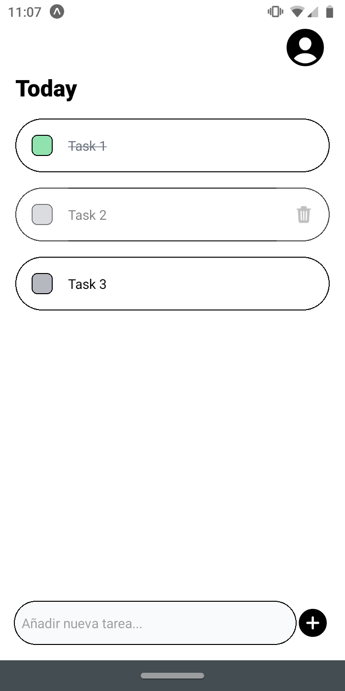

# ToDoZen

**ToDoZen** is a mobile application that simplifies task management, making it easy and efficient to create and manage your to-do lists.

  
  
  
  
  

## Getting Started

To get started with **ToDoZen**, follow these steps:

- [Server README](/server/README.md)
- [Client README](/client/README.md)

## Screenshots

  

    

  

  

  

  

## License

This project is Licensed under the [MIT License](./LICENSE).